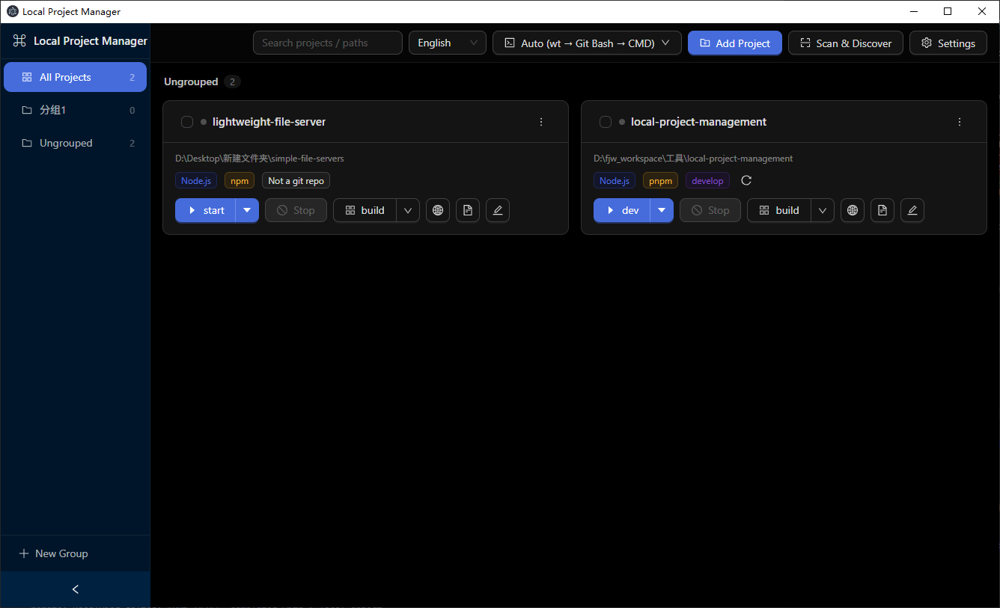
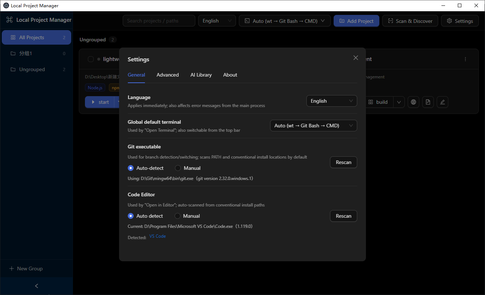
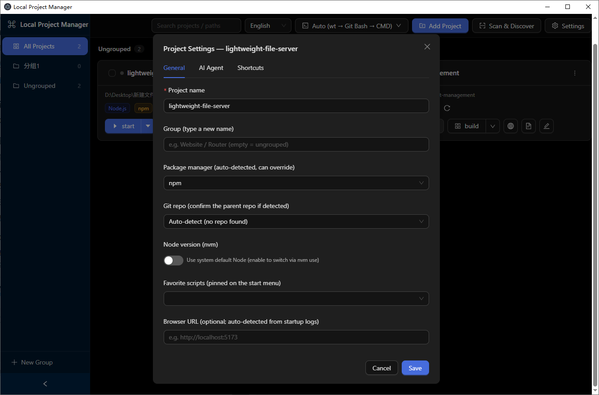

# Local Project Manager

**English** · [简体中文](docs/README_CN.md)

A **local project management / launcher** desktop app for developers. It gathers all your local projects into one always-ready card panel — scan & discover, one-click script launching, real-time logs, branch switching, group organization — so you never have to juggle terminal windows again.

Built with **Electron + Vite + React + TypeScript**, **Windows-first**, with macOS / Linux support.

> See [ARCHITECTURE.md](ARCHITECTURE.md) for architecture and extension guide, [AGENTS.md](AGENTS.md) for development conventions and pitfalls.

---

## 📸 Screenshots

**Main interface** — the project card panel



**Settings center** — language / default terminal / data backup / AI library



**Project settings** — general / AI agent / shortcut commands



---

## ✨ Features

### Project Management

- **Scan & discover**：Configure one or more scan directories; local projects are auto-detected by marker files (e.g. `package.json`). Already-imported projects are flagged 「imported」, and directories that already resolve to a project are not descended into again (great for monorepos)
- **Manual import**：Pick any directory to add with name / type / package manager auto-prefilled, and detect the **parent git repository** for you to confirm
- **Grouping**：Sidebar group navigation with create / rename / delete, and **batch-move** projects into groups
- **Batch operations**：Multi-select cards to batch-remove from the list or move into the **system recycle bin** (restorable)
- **Global search**：Instant filter across name / path / group / scripts / package manager / branch — any visible info on a card

### One-Click Run

- One-click run of common scripts (`dev` / `start` / `preview` type starters; `build` scripts auto-grouped) straight from the card, or pick any `npm script` from the dropdown
- **Clean shutdown**：On Windows the entire process tree is killed via `taskkill /pid /T /F`, so no stray dev servers are left behind; all running tasks are cleaned up before the app quits
- **Custom command shortcuts**：Configure arbitrary shell commands per project and surface them as card buttons
- **Multiple Node versions**：Built-in **nvm-windows** integration — run scripts with a per-project Node version
- **nvm / package manager detection**：Auto-detected (`packageManager` field > lock files), and manually overridable between npm / pnpm / yarn / bun

### Run Observation

- **Real-time logs**：A live-scrolling log drawer with color-coded stdout / stderr, persisted to the database as it streams
- **History replay**：Each run keeps the latest 50 history entries and the last 2000 log lines, reviewable after restart
- **Browser shortcut**：Auto-detects `localhost` service URLs from run logs and opens them in one click; a manual URL can be set too
- **In-app package.json editing**：Edit and validate JSON right on the card and write it back to disk

### Git Integration

- **Smart repo-root resolution**：Manual override > scan upward for `.git` (monorepo sub-packages automatically resolve to the parent repo)
- **Branch switching**：Switch right on the card, with local / remote-tracking branches shown in groups; **dirty worktrees ask for a second confirmation** before switching
- **Remote updates**：One-click `git fetch --all --prune`, plus **branch search**

### Environment Integration

- **Multiple terminals**：Open Windows Terminal / Git Bash / CMD / PowerShell by preference, with a visual default-fallback strategy in the top bar
- **Multiple editors**：Auto-detects any installed VS Code / Insiders / VSCodium / Cursor and opens the project with one click

### AI Assistance

- **Agent templates**：Built-in Claude Code / Cursor templates, with customizable commands and models
- **Skill library**：Maintain reusable Markdown skills and write them into a project's `.claude/skills/<id>/SKILL.md` in one click
- **Project briefing hosting**：Summarizes enabled agents and skills into the **sentinel block** of the project's `CLAUDE.md` / `AGENTS.md`, never overwriting hand-written content

### Data & Security

- **Auto backup**：Backs up the database on an interval with a retention limit; manual backup / **restore** / **export** / **import** supported
- **Open to extension**：Project types are driven by an **adapter interface** — adding a new type only requires implementing one interface
- **Security sandbox**：`contextIsolation: true` + `nodeIntegration: false`; preload exposes only allow-listed channels, so the renderer has no direct Node / Electron surface

### UI

- **Bilingual**：Follows the system language with a manual switch that is remembered; antd component text stays in sync
- **Dark theme**：Full dark theme via antd 5 `darkAlgorithm`

---

## 🧰 Tech Stack

| Layer         | Tech                                                                 |
| ------------- | -------------------------------------------------------------------- |
| Desktop shell | Electron 37                                                          |
| Build         | electron-vite 3 + Vite 6                                             |
| UI            | React 18 + Ant Design 5 (`@ant-design/icons`)                        |
| State         | zustand                                                              |
| i18n          | i18next + react-i18next (one shared locale pack for main & renderer) |
| Data          | **SQLite** (Electron's built-in `node:sqlite`, zero native deps)     |
| Language      | TypeScript 5 (dual tsconfig: main + web)                             |
| Quality       | ESLint + Prettier + husky / lint-staged (auto-format on pre-commit)  |

---

## 🚀 Getting Started

### Requirements

- [Node.js](https://nodejs.org) **20+**
- [pnpm](https://pnpm.io) package manager
- Platform: Windows (preferred) / macOS / Linux

### Install & Run

```bash
# Install dependencies
pnpm install

# Development (hot-reload launch of the app)
pnpm dev
```

### Common Commands

| Command                        | Description                                                     |
| ------------------------------ | --------------------------------------------------------------- |
| `pnpm dev`                     | Dev mode — launches Electron with hot reload                    |
| `pnpm start`                   | Preview the built output (`electron-vite preview`)              |
| `pnpm build`                   | Build into `out/`                                               |
| `pnpm typecheck`               | Type-check both main and web tsconfigs                          |
| `pnpm lint` / `pnpm lint:fix`  | ESLint check / auto-fix                                         |
| `pnpm format`                  | Prettier formatting across the repo                             |
| `python scripts/check-i18n.py` | Verify i18n keys referenced in code match the bilingual locales |

---

## 🗂️ Project Structure

```
src/
├─ main/              Main process
│  ├─ index.ts        Window & lifecycle (kills the process trees of all tasks before quit)
│  ├─ ipc.ts          All IPC handler registration + project info enrichment
│  ├─ db.ts           SQLite data layer (the only DB access point)
│  ├─ config.ts       Scan / app / AI-library settings read & write
│  ├─ scanner.ts      Directory scanning + single-dir inspection
│  ├─ tasks.ts        Process manager (spawn / tree-kill / log buffering / event push)
│  ├─ git.ts          Git operations (parent-repo resolution, info, branch switch, fetch)
│  ├─ nvm.ts          nvm environment detection
│  ├─ terminal.ts     Open system terminal (wt → gitbash → cmd fallback)
│  ├─ editor.ts       Code editor detection & open (VS Code family / Cursor family)
│  ├─ browser.ts      Open browser (manual URL > run-log detection > history logs)
│  ├─ aiWriter.ts     AI skill / briefing write-to-disk (sentinel-block merge)
│  ├─ backup.ts       Backup / restore / import-export / auto-backup scheduling
│  ├─ i18n.ts         Main-process copy
│  └─ adapters/       Project-type adapters (the extension core; Node.js implemented)
├─ preload/index.ts   contextBridge API (allow-listed channels)
├─ shared/            All shared types / API interfaces / locale packs
└─ renderer/src/      Renderer components & state
   ├─ store.ts        zustand global state
   └─ components/     ProjectCard / LogDrawer / SettingsModal / ImportModal /
                      PackageJsonModal / ProjectSettingsModal / GroupModals / PreferencesModal
```

The data file lives at `%APPDATA%/local-project-management/app.db` (macOS: `~/Library/Application Support/...`).

---

## 🧩 Core Design

- **Project-type adapters**：Generic capabilities (process management, logs, git, grouping) don't know about project types; all differences are confined to the `ProjectTypeAdapter` interface (`detect / loadInfo / buildSpawn / resolveBrowserUrl`).
- **Persistence**：SQLite (settings / projects / runs / logs tables); lightweight column migrations via `ensureColumn()`.
- **Process safety**：On Windows, stopping a task must kill the process tree; a user-initiated stop is recorded as 「exited」, not 「failed」.
- **Extensible i18n**：Locale files are constrained with `satisfies Dict`, so a missing key is a compile error.

Full design details in [ARCHITECTURE.md](ARCHITECTURE.md).

---

## 🗺️ Roadmap

- [ ] **Java / Python / Docker** project-type adapters (placeholders already shown as 「coming soon」 in the UI)
- [ ] nvm POSIX (shell function) support
- [ ] Make main-process error messages follow the UI language instead of the system language

---

## 📄 License

[MIT](LICENSE) © 2026 Yuban32
